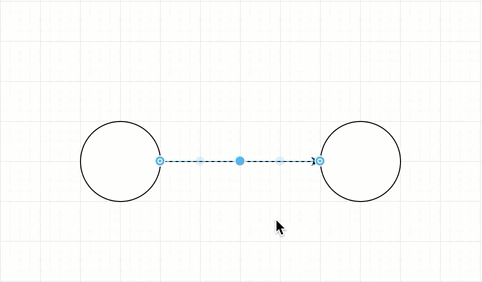
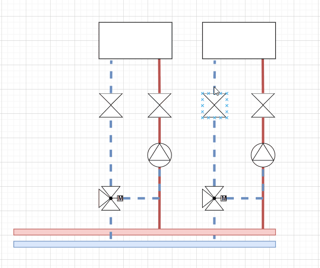

# Diagramm.net

## Für was ist es gut
Diagrams.net ist eine open source Software, zur erstellung von Diagrammen, Schemas, Abläufen, Datenbanken und vieles mehr.

!> Wir bieten eine Kostenlose Bibliothek mit Bauteilen für die HLKSE Branche

- yes
- yes, really

| Tables        | Are           | Cool  |
| ------------- |:-------------:| -----:|
| col 3 is      | right-aligned | $1600 |
| col 2 is      | centered      |   $12 |
| zebra stripes | are neat      |    $1 |

## Beispiele

### M-Bus Schema

[Link zur Datei](https://test.com)

### Verteiler

[Link zur Datei](https://test.com)

### M-Bus Schema

[Link zur Datei](https://test.com)

### M-Bus Schema

[Link zur Datei](https://test.com)

### M-Bus Schema

[Link zur Datei](https://test.com)

### M-Bus Schema

[Link zur Datei](https://test.com)

## Schnell Start 

Gehen Sie auf [Diagrams.net](https://app.diagrams.net) 

## Links

- [Anleitungen vom Entwicklwer (Englisch)](https://app.diagrams.net)
- [Shortcuts](https://viewer.diagrams.net/#Uhttps%3A%2F%2Fviewer.diagrams.net%2Fshortcuts.svg)
- 
- 